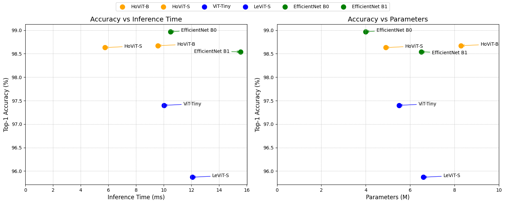
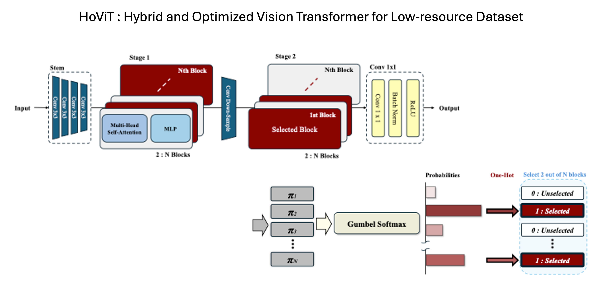

# HoViT: Hybrid and Optimized Vision Transformer for Low resource Dataset



## Abstract

Vision Transformer (ViT) models have shown outstanding performance across various vision tasks, but their high computational cost and latency have limited their applicability in real-time and resource-constrained environments. HoViT (Hybrid and Optimized Vision Transformer) is an unofficial research implementation designed to address these challenges. The model incorporates a convolutional stem to extract low-level features efficiently and employs a lightweight Transformer architecture with a novel Gumbel-based block selection mechanism. This structure enables dynamic computation paths, reducing inference time without significant performance degradation. Additionally, HoViT supports Low-Rank Adaptation (LoRA) for efficient fine-tuning.

## Model Architecture




The architecture of HoViT follows a hybrid CNN-Transformer pipeline with the following structure:

	1.	Stem: A series of convolutional layers for early feature extraction.
	2.	Stage 1: Multiple LevitBlocks with Gumbel softmax gates for selective execution.
	3.	Stage 2: Downsampling followed by additional gated LevitBlocks.
	4.	Conv1x1: Channel adjustment using a 1x1 convolution.
	5.	Classification Heads: Two parallel linear heads for standard and distilled predictions.

Features

•	CNN-Transformer hybrid design </br>
•	Gumbel softmax-based block selection for computational efficiency </br>
•	Optional Low-Rank Adaptation (LoRA) for parameter-efficient fine-tuning </br>

## Dataset

The model was evaluated on the following datasets: NCT-CRC-HE-100K, CRC-VAL-HE-7K

These datasets are used for training, validation, and testing. Index splits are defined in configs/index_dict.json.

### How to Use

Installation
```
pip install -r requirements.txt
```
Training
```
python main.py --mode train --config configs/HoViT.yaml
```
Evaluation
```
python main.py --mode eval --checkpoint pretrained/weight.pth
```

## Additional Experiments

Additional experimental results, analysis notebooks, and utility scripts can be found at the following repository:

https://github.com/hun9008/AI_TeamProject_24FW

This repository includes supplementary evaluation code, visualization tools, and ablation studies conducted as part of the project.